# AWS Infrastructure Automation using Boto3

## 📌 Overview

This project demonstrates how to launch and manage AWS resources programmatically using Python and AWS SDK (Boto3).

Instead of manually creating resources through the AWS Management Console, this project automates infrastructure provisioning using Python scripts.

This activity was performed as part of the Cloud Native Application course.

---

## 🎯 Activity Objective

To configure AWS SDK and launch AWS resources using Python for the following services:

- Amazon EC2
- Amazon S3
- Amazon VPC
- AWS IAM

---

## 🏗 Complete Project Flow

The complete implementation flow of this project:

1. Create IAM User with Programmatic Access
2. Configure AWS CLI
3. Install Boto3 SDK
4. Create AWS Resources using Python:
   - S3 Bucket
   - VPC
   - EC2 Instance
   - IAM Role
5. Execute `main.py`
6. Verify resources in AWS Console
7. Delete resources after demonstration (to avoid billing)

---

## 🔐 Step 1: Create IAM User

- Logged in to AWS Console
- Opened IAM Dashboard
- Created a new IAM user
- Enabled **Programmatic Access**
- Attached `AdministratorAccess` policy
- Generated:
  - Access Key ID
  - Secret Access Key

These credentials were used to configure AWS CLI.
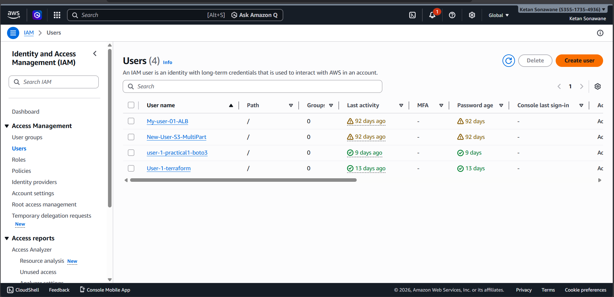
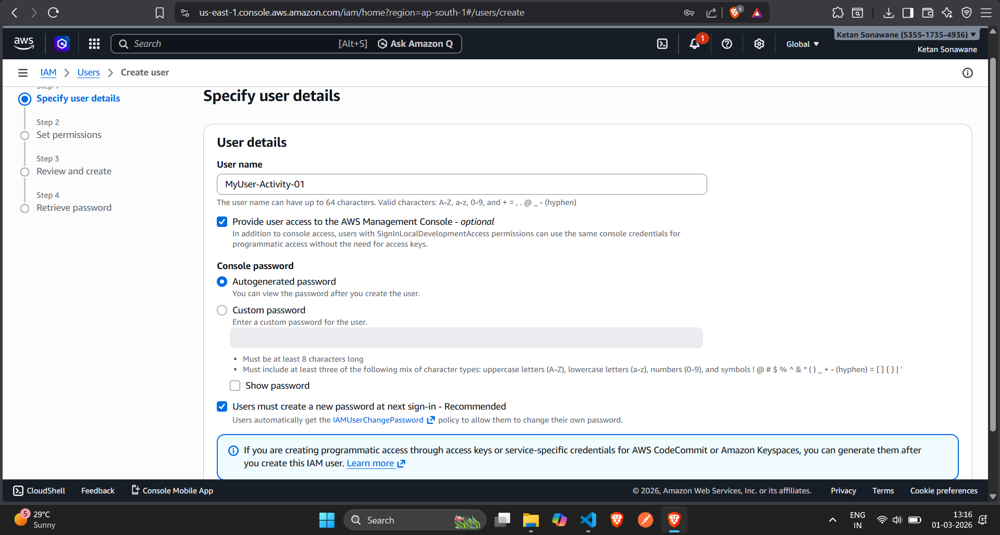
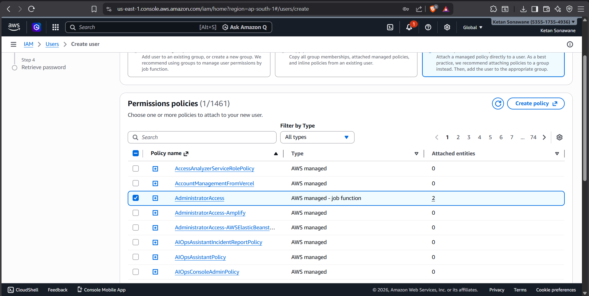
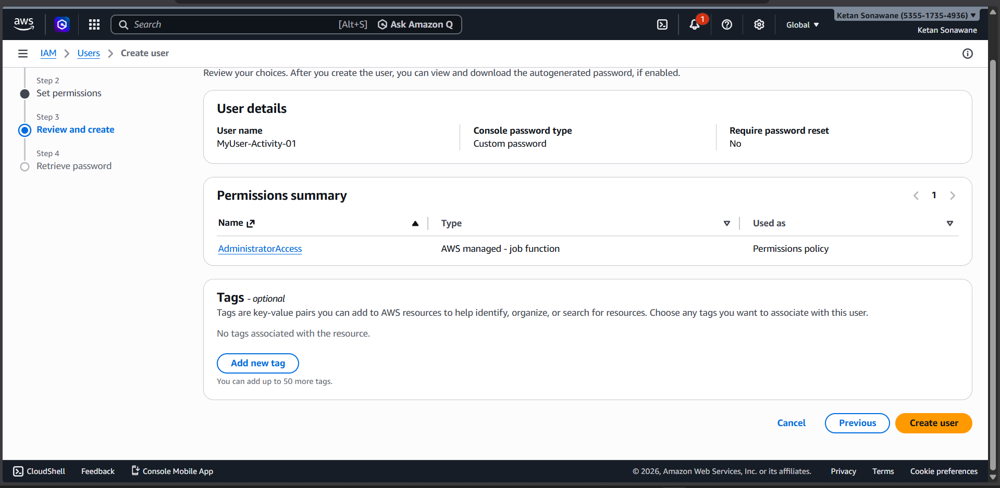

---

## ⚙ Step 2: Configure AWS CLI

AWS CLI was installed and configured using:

```bash
aws configure
```

Entered the following details:

- AWS Access Key ID  
- AWS Secret Access Key  
- Region: ap-south-1  
- Output format: json  

This connects the local system to the AWS account.

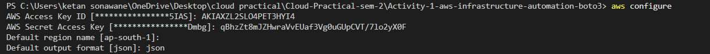

---

## 🗂 Configuration File (`config/config.py`)

The `config.py` file centralizes all configuration values required across the project.

Instead of hardcoding values in multiple scripts, all common parameters are stored in one place.

### Purpose of config.py

- Stores AWS region
- Stores S3 bucket name
- Stores EC2 AMI ID
- Stores instance type
- Stores key pair name
- Makes project modular and maintainable

### Benefits

- Easy modification
- Cleaner code
- Better scalability
- Follows best practices

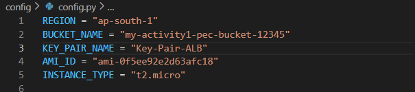

---

## 🚀 Step 4: Create AWS Resources Using Python

Resources were created using separate Python files.

```bash
python main.py
```
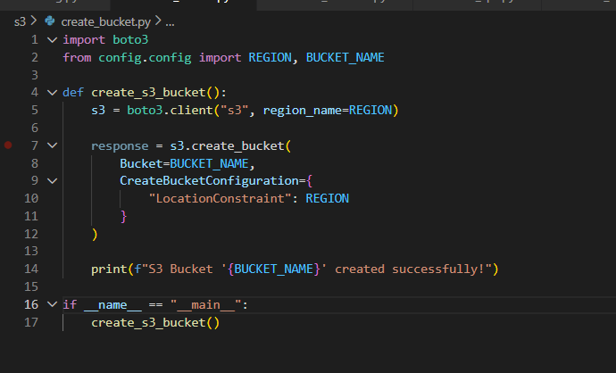
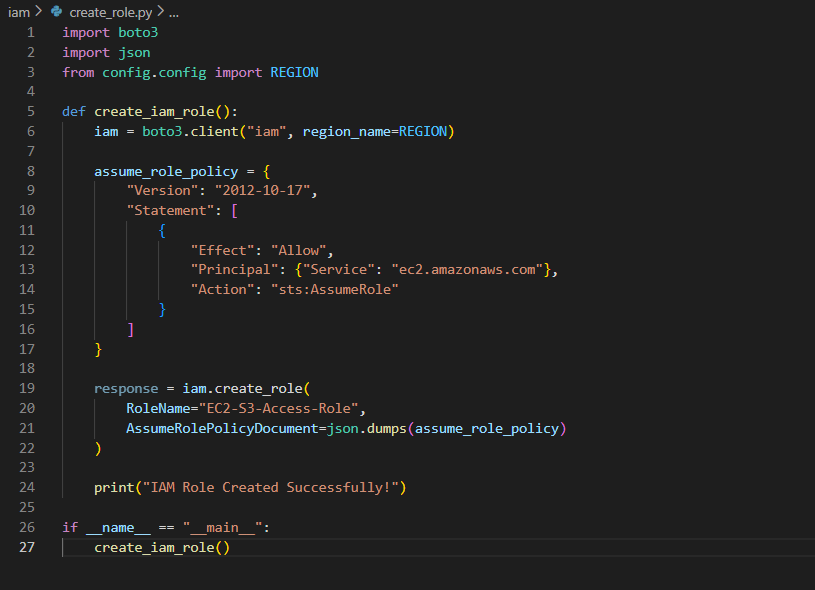
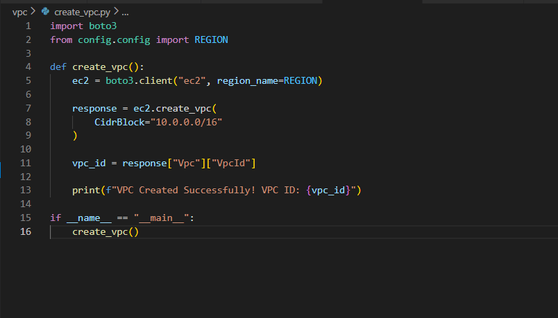
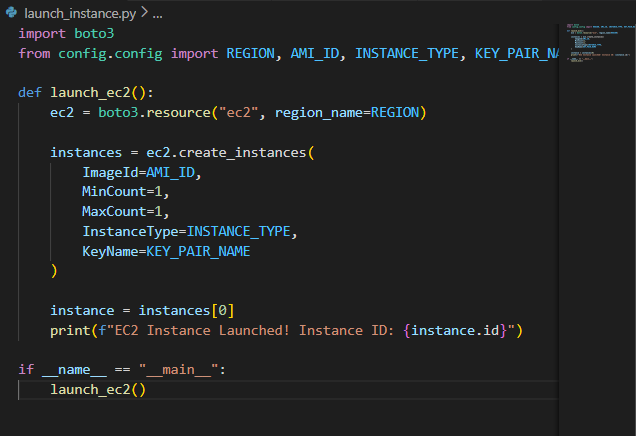
---

## 🚀 Main Execution File (`main.py`)

The `main.py` file acts as the central controller of the project.

Instead of running each script manually, `main.py` imports all resource creation functions and executes them sequentially.

### Purpose of main.py

- Controls execution flow
- Calls all creation functions
- Automates infrastructure provisioning
- Ensures correct execution order

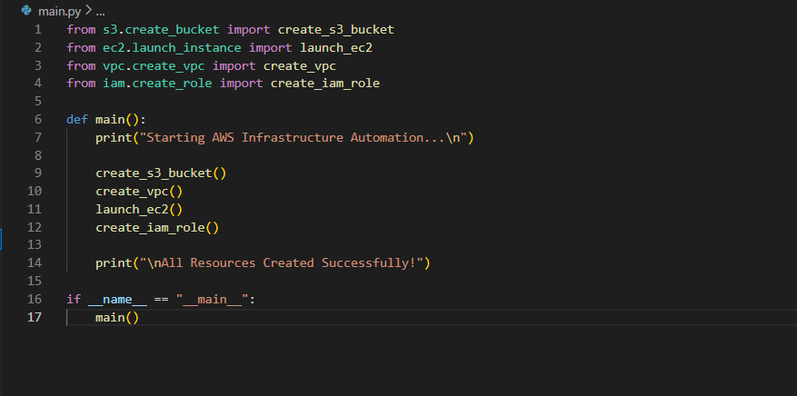

### Execution Order

1. S3 Bucket
2. VPC
3. EC2 Instance
4. IAM Role

---

## 💻 Sample Terminal Output

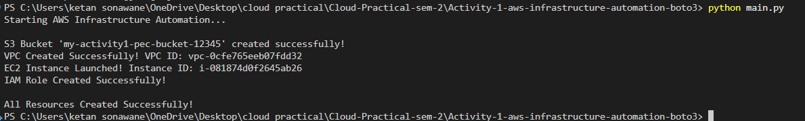

## 🔍 Step 5: Verification in AWS Console

After execution, resources were verified in:

- EC2 Dashboard → Instance running
- S3 Dashboard → Bucket created
- VPC Dashboard → VPC available
- IAM Dashboard → Role created

---

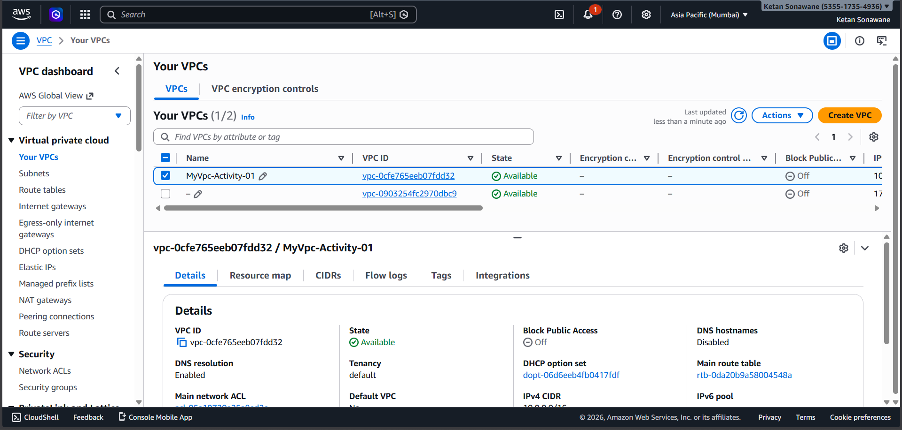
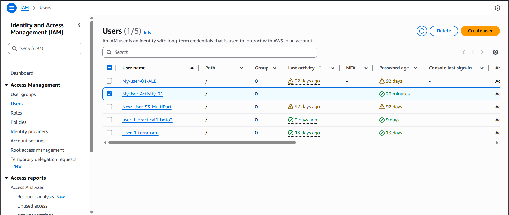
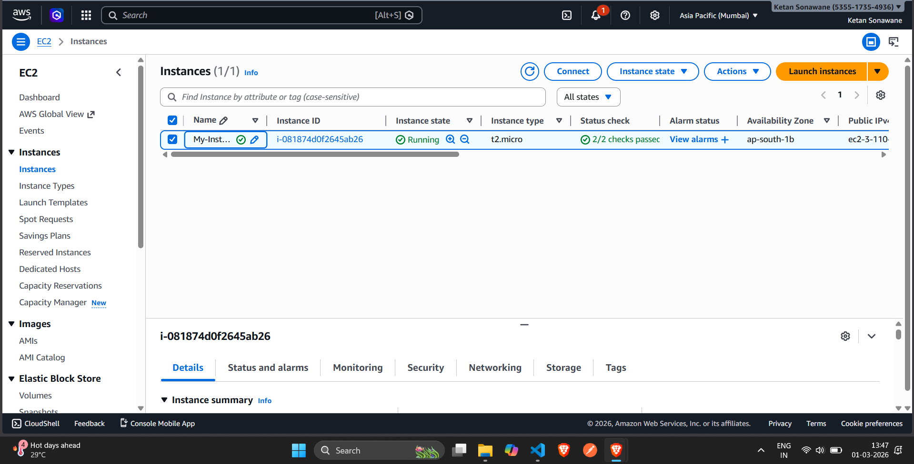

## 📁 Project Structure

```
aws-infrastructure-automation-boto3/
│
├── screenshots/
│   ├── iam_user.png
│   ├── aws_configure.png
│   ├── terminal_output.png
│   ├── ec2_running.png
│   ├── s3_bucket.png
│   ├── vpc_created.png
│   └── iam_role.png
│
├── config/
│   └── config.py
│
├── create_bucket.py
├── create_vpc.py
├── launch_instance.py
├── create_role.py
├── main.py
│
└── README.md
```

---

## 📷 Output Screenshots

### 💻 Terminal Execution Output


### 🚀 EC2 Instance Running


### 📦 S3 Bucket Created


### 🌐 VPC Created


### 🔑 IAM Role Created


---

## 🛠 Technologies Used

- Python
- AWS SDK (Boto3)
- AWS CLI
- Amazon EC2
- Amazon S3
- Amazon VPC
- AWS IAM

---

## 📚 Learning Outcomes

Through this activity, the following concepts were understood:

- AWS SDK configuration
- Infrastructure provisioning using Python
- Cloud automation
- IAM access control
- Resource dependency management
- Verification of cloud resources

---

---

## 👨‍💻 Author

Ketan Sonawane 

BTech – Cloud Native Application  
Activity No. 1  
